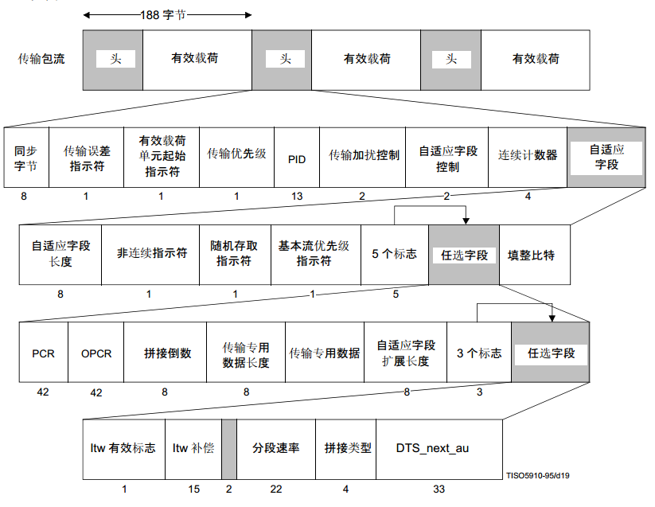
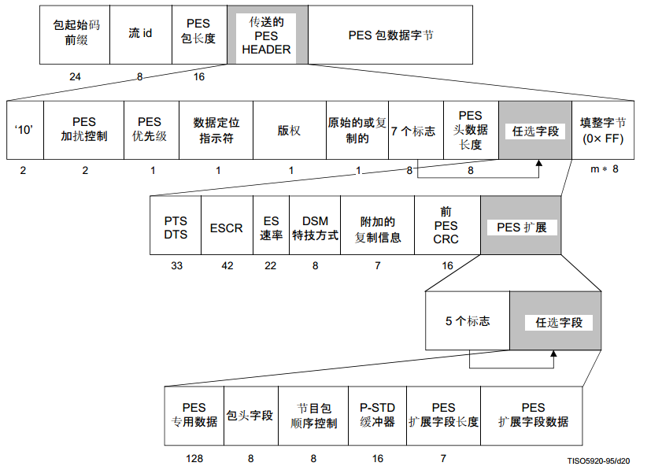
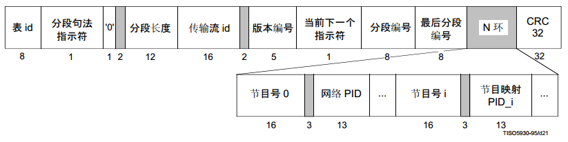
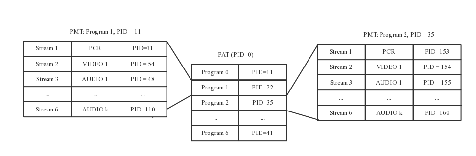
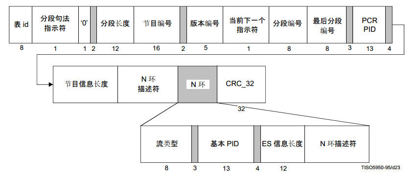
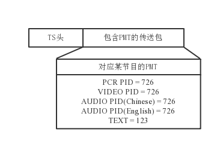

---
layout:     post
title:      mpeg-ts格式详解
subtitle:   mpeg-ts格式详解
date:       2025-08-28
times:      23::56::35
author:     chensong
header-img: img/2019-02-02/bg_socketopt.jpg
catalog:    true
tags:
    - VLC
    - MPEG-TS
    - TS
---

# 前言

## 一、基本概念

### 1、ES流（Elementary Stream）：基本码流，可以理解为编码后的裸数据；

### 2、PES流：分割打包的ES流，加入了PES头。PES包是可变长度的，PES头中最重要的部分是显示时间标记（Presentation Time Stamp， PTS）和解码时间标记（Decode Time Stamp， DTS），有了PTS和DTS，再加上节目时钟参考PCR，解码器就能从TS流中重建视频流；

1. PTS   显示时间标记（Presentation Time Stamp， PTS）
2. DTS   解码时间标记（Decode Time Stamp， DTS）
3. PCR   节目时钟参考PCR，解码器就能从TS流中重建视频流；

### 3、TS流（Transport Stream）：传输流。固定包长度为188B，TS流固定包长度的好处是便于找到帧的起始位置，易于从包丢失中恢复，适合于有误码的环境

## 二、TS流格式

### 1 TS流格式

TS header是4byte，分别是1byte的同步字节，1bit传输数据包差错指示， 1bit净荷单元起始指示， 1bit传送优先权， 13bit包标识符PID， 2bit传送加扰控制，2bit调整字段控制和4bit连续计数器。 

	
- 同步字节（sync byte）: 1B，其值固定为0x47，该字段是MPEG-2 TS传送包标识符；

- 传输误差指示符（transport error indicator）: 1bit，其值为1时，表示在相关的传送包中至少有一个不可纠正的错误位，只有在错误纠正之后，该位才能被重新置0；

- 有效载荷单元起始符（payload unit start indicator）: 1bit, 当TS包带有PES包数据时，置为1，表示TS包的有效净荷以PES包的第一个字节开始；置为0，表示该TS包的开始不是PES包；当TS包带有PSI数据时，置为1，表示TS包带有PSI部分的第一个字节，即第一个字节带有指针pointer_field；置为0，表示TS包不带有一个PSI部分的第一个字节，即有效净荷中没有指针pointer_field。空包时，该位置为0；

- 传输优先级（transport_prority）: 1bit, 置为1，表示相关的包比其他具有相同PID，但是此字段置0的包有更高的优先级；

PID: 13bit, 表示传送包的有效净荷中的数据的类型。具体如下表：

|PID取值　|PID值使用描述|
|:---:|:---|
|0x0000|节目关联表（program association table, PAT）|
|0x0001|条件访问表（conditional access table, CAT）|
|0x0002|传送流描述表（transport stream description table, TSDT）|
|0x0003~0x000F|保留|
|0x0010~0x1FFE|可以分配为network PID, Program map PID,  elementary PID, 或其它 |
|0x1FFF|空包（8191）|

PID信息非常关键，它直接表征本次TS包的用途。比较重要的是PAT和PMT，之后会有说明;

　　传输加扰控制（transport scrambling control）: 2bit，该字段用来指示传送流包有效净荷的加扰方式；

　　自适应字段控制（adaption field control）: 2bit，表示传送流包首部是否跟随有调整字段和/或有效净荷。具体如下表：

|调整字段值|描述|
|:---:|:---|
|00|保留|
|01|没有调整字段，仅含有184B长度的有效净荷|
|10|没有有效净荷，仅含有183B长度的调整字段|
|11|0~182B的调整字段后为有效净荷|

　连续计数器（continuity counter）: 4bit，随着具有相同PID TS包的增加而增加，达到最大则恢复为0

### 2、 TS流调整字段
　　在MPEG-2 TS中，为了传送打包后长度不足188B的不完整TS，或者为了在系统层插入节目时钟参考（program clock reference， PCR），需要在TS包中插入可边长字节的调整字段。调整字段其中一个重要作用是解决编解码器的音视频同步问题。一般在视频帧中的TS包的调整字段中，每隔一定传输时间，传送系统时钟27MHz的一个抽样值给接收机，作为解码器解码时的时钟参考信息PCR。PCR通常每隔100ms至少被传输一次。PCR的数值所表示的是解码器在读完这个抽样值的最后那个字节时，解码器本地时钟所应处的状态。通常情况下，PCR不直接改变解码器的本地时钟，而是作为参考基准来调整本地时钟，使之与PCR趋于一致。

### 3、PES包格式

　　PES包的第5个字节标识一整个PES包的长度，一般来说，一个PES包包含一帧图像，获取了PES的包长度Len，当接收到Len个字节后，将接收到的字节组成一个block，放入FIFO中，等待解码线程解码。DTS和PTS也在PES包中传送。

## 三、节目专用信息（Program Special Information， PSI）

前边提到了PAT和PMT，它们都是PSI之一。MPEG-2 TS传送TS包，这些包携带两类信息：已压缩的音视频（PES）和与之相关的符号化表（PSI），由传送包的PID来识别。

### 1 、节目关联表（Program Association Table， PAT）

PAT定义了TS中的所有节目，其值为0x0000，是PSI信息的根结点。其格式如下图。

上图中，程序在解析到N环部分的时候，会读取并保存节目列表及其PID。PAT信息在TS流中隔一段时间就会传送，接收机在接收时，以接收PAT表为起始。PAT表列出了TS流中所有的节目列表，以及节目对应的PID值，这个PID值表征的是该节目对应的PMT表的PID值（PMT表稍后说明）。PAT表与PMT的关系如下图。

### 2、 节目映射表（Program Map Table， PMT）

PMT提供一路节目包含的所有原始码流的PID映射表，其格式如下图。

程序在读取N环的时候会读取该节目所有的码流列表及其PID，解析的时候可以根据PID来分离。这N环描述符包括的信息如下图所示。节目时钟参考PCR的PID和视频的PID是相等的。由PAT得出所有的节目列表，选定收看的节目后，筛选出等于该节目PID的TS包，就可以得到该节目的所有码流的PID映射表，这样接收机就可以只接收PID等于该节目的码流的TS包即可收看该节目

## 四、音视频同步

前边介绍的是TS流用的最多的格式，以及PAT和PMT等，现在说一下TS流在解码时是如何做到音视频同步的

### 1、时间标记与PTS和DTS

时间标记本身是以90KHz单位表达的33bit二进制值，是MPEG-2系统层提供的一种机制，以便确保在解码器上相关的原始流之间正确的同步。时间标记有两类：一个是解码时间标记（DTS，Decode Time Stamp）， 它规定了在某时间应该从解码器缓冲区中删除一个访问单元并解码，但是不进行播放；另一个是显示时间标记（PTS，Present Time Stamp），它规定了在某时刻，解码的图像最后从临时缓存中释放出来并进行播放。这样PTS将总是比与之相关的DTS大

### 2、音视频同步

在MPEG-2编码器中有一个系统时钟，该系统时钟用来生成一个共同的时序以便音视频能够正常的解码与播放。因为编码器有共同的系统时钟STC，解码器中的时钟可以根据PCR重新恢复。所以端到端的同步分为以下几个步骤：

（1） 解码器接收到PCR时，恢复系统时钟；

（2） 解码器接收到PTS/DTS时，存入对应的堆栈；

（3） 每幅图像解码前，用其对应的DTS与系统时钟STC进行比较，当两者相等时，就开始解码；

（4） 每幅图像播放前，用其对应的PTS与系统时钟STC进行比较，当两者相等时，就开始播放。

　　实际应用时，解码器一般都有自主的系统时钟频率，不能直接拿编码器的PCR设置为解码器的系统时钟STC，而是利用接收到的PCR值，通过锁相环PLL校正解码器的系统时钟STC

# 总结
